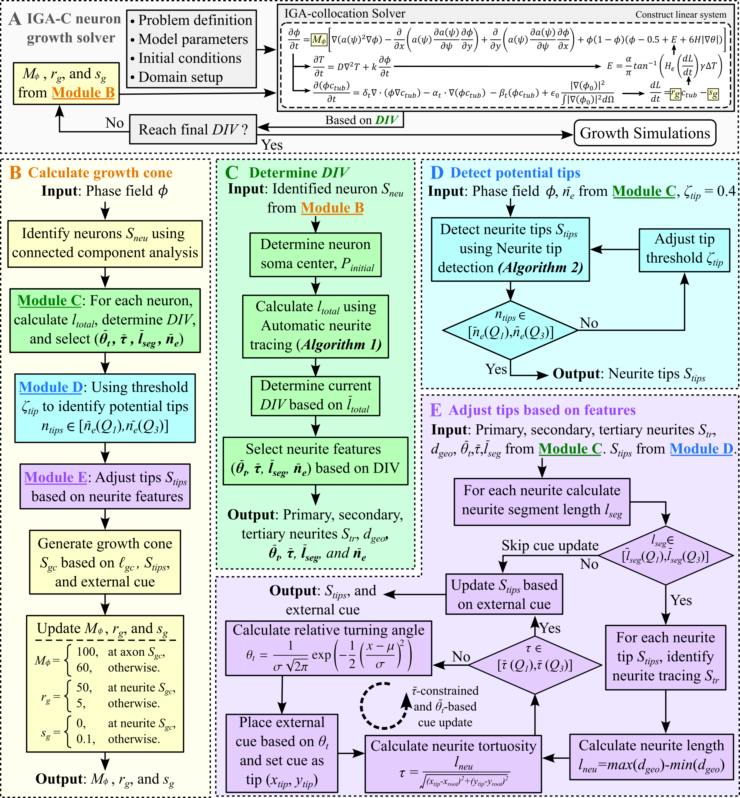
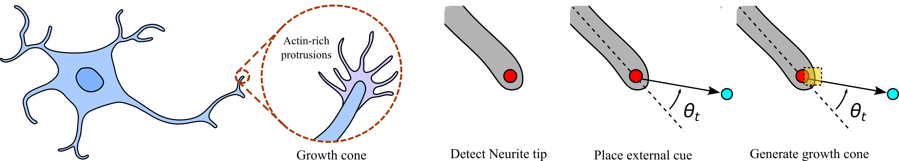
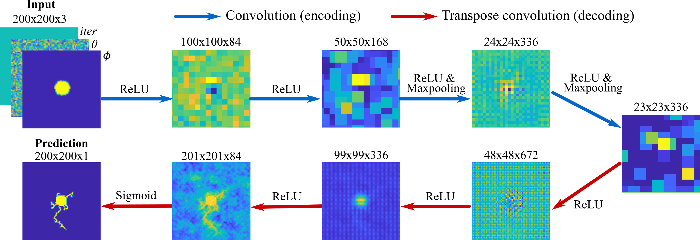

# Feature-driven IGA-C Neuron Growth Model
Incorporating experimental neurite morphometric features into a phase field method-based neuron growth model using an isogeometric analysis collocation (IGA-C) approach.

## User Guide
This code is the implementation of the phase field model using isogeometric collocation to simulate neuron growth with intrinsic growth stage transition by leveraging experimental neurite morphometric features extracted using semi-automated quantitative analysis. The gradient computation of Φ is carried out using cubic B-splines to increase the smoothness of the solution.

## File structures
- **[Feature_drive_NG_model](https://github.com/CMU-CBML/FDNGCNN/tree/main/Feature_driven_NG_model)**: contains the implementation of 2D Phase field model for neuron growth code using isogeometric collocation method.
	- **[IGA_collocation_algorithm](https://github.com/CMU-CBML/NeuronGrowth_IGAcollocation/tree/main/IGA_collocation_algorithm)**: contains necessary functions built and used in the model.
	- **[caseX_X]**: contains code necessary to reproduce simulation results shown in the paper.
	- **[all_results](https://github.com/CMU-CBML/FDNGCNN/tree/main/Feature_driven_NG_model/all_results)**: contains final growth image of all cases.
	- **paramGen.m**: Matlab script used to generated batch simulation scripts.
	- **submit_jobs.m**: slurm script used to submit batch simulation on Pittsburgh Supercompter Center (PSC)

- **[ML_models](https://github.com/CMU-CBML/FDNGCNN/tree/main/ML_models)**: contains CNN surrogated model for both feature-driven model and our previous model.
	- **[NeuronGrowthML_Pytorch_all_BCE_neuriteFeaturesModel_04182023](https://github.com/CMU-CBML/FDNGCNN/tree/main/ML_models/NeuronGrowthML_Pytorch_all_BCE_neuriteFeaturesModel_04182023)**: contains code and saved data necessary to reproduce CNN surrogate model for feature-driven neuron growth model
	- **[NeuronGrowthML_Pytorch_all_BCE_oldModel_04182023](https://github.com/CMU-CBML/FDNGCNN/tree/main/ML_models/NeuronGrowthML_Pytorch_all_BCE_oldModel_04182023)**: contains code and saved data necessary to reproduce CNN surrogate model for our previous neuron growth model
	

## How to run
1. Valid installation of Matlab (code written with Matlab 2021a)
2. Navigate to the case you want to run (or create a new one) **[caseX_X]**
3. Run *main.m*. For simulation cases in paper, run *main.m* in each folder for that specific case.
4. Note that cases were ran on Bridges-2 Supercompter server at Pittsburgh Supercomputer center, which limits wall time to 48 hrs, so most simulations required a restart. To reproduce exact results in paper, please load 'workspace.mat' first and use the random seed variable rngSeed

## Reference
1. K. Qian, A. Pawar, A. Liao, C. Anitescu, V. Webster-Wood, A. W. Feinberg, T. Rabczuk, Y. J. Zhang, Modeling neuron growth using isogeometric collocation based phase field method, Scientific Reports 12 (2022) 8120. (https://github.com/CMU-CBML/FDNGCNN/tree/main/ML_models/NeuronGrowthML_Pytorch_all_BCE_oldModel_04182023)
2. A. S. Liao, W. Cui, Y. J. Zhang, V. A. Webster-Wood, Semi-automated quantitative evaluation of neuron developmental morphology in vitro
using the change-point test, Neuroinformatics 21 (2022) 163–176. (https://pubmed.ncbi.nlm.nih.gov/36070028/)
